# Object Detection in an Urban Environment

## Project Overview
This project is to train deep learning models for object detection using Waymo dataset which is the real world dataset. Object detection is one of the most crutial tasks of self driving car systems since with the accurate detection results of objects in driving situations, self driving car can plan its behavior, trajectories and control parameters, and if it fails to perceive obstacles, it could lead to a critical accident. By this project, it can be expected that we can practice how to use Tensorflow Object Detection API and train various types of deep learning models to improve detection performance using the Waymo real world dataset.

---
## Set up
To build an environment for train and evaluate models, you can use `requirements.txt` in `./build` directory.
``` bash
$ pip install -r ./build/requirements.txt
```

---
## Dataset
Waymo dataset is one of the most popular real world datasets which is mostly used to evaluate the performance of object detection models. In Waymo perception dataset, it contains multi-modal data including not only camera images but also LiDAR point cloud and their calibrations. Although it includes several sensor data, we only utilize camera images only to detect objects in this project. The examples of images and bounding box labels are under below.

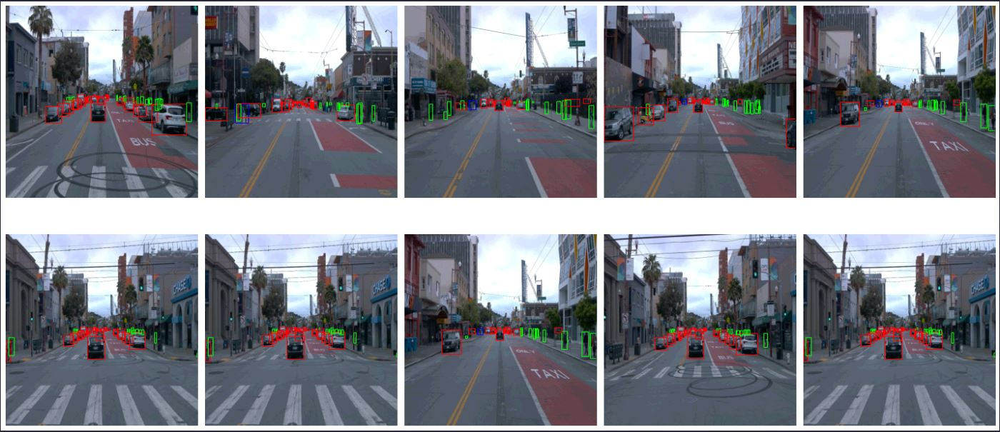

In the images, red boxes are labels of vehicle, green boxes are labels of pedestrian, and blue boxes are labels of cyclist respectively.

In this project, Waymo dataset is provided for about 100 .tfrecord files and it is needed to split these files into train, validation and test data. When I split all .tfrecord data into train and validation data, basically I try to split them in the ratio of 8:2. However, we need to be careful about randomly splitting files in 8:2 and what we should check before is the number of each class (in the project, car, pedestrian and cyclist) of each .tfrecord file. To do this, I randomly sample images (in the code, 10000 images) from dataset of each .tfrecord file, count the number of each class and plot them below.

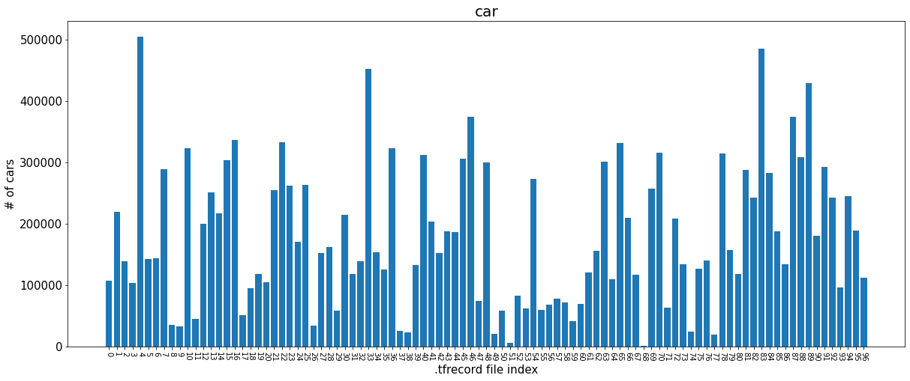

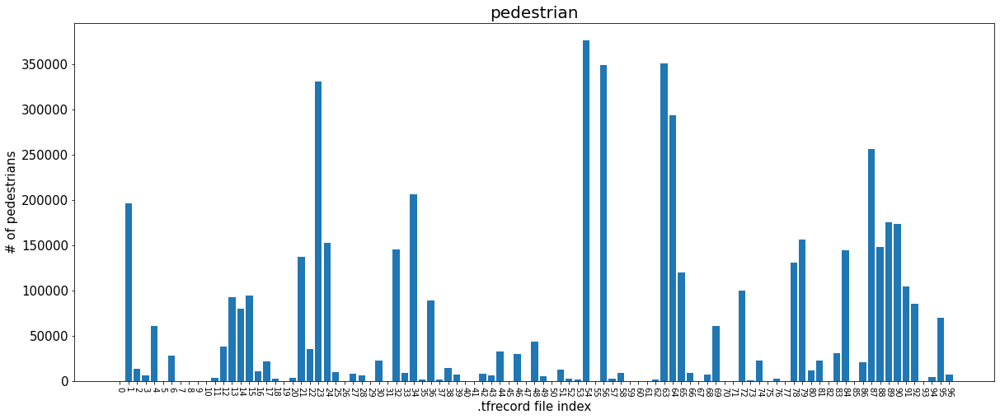

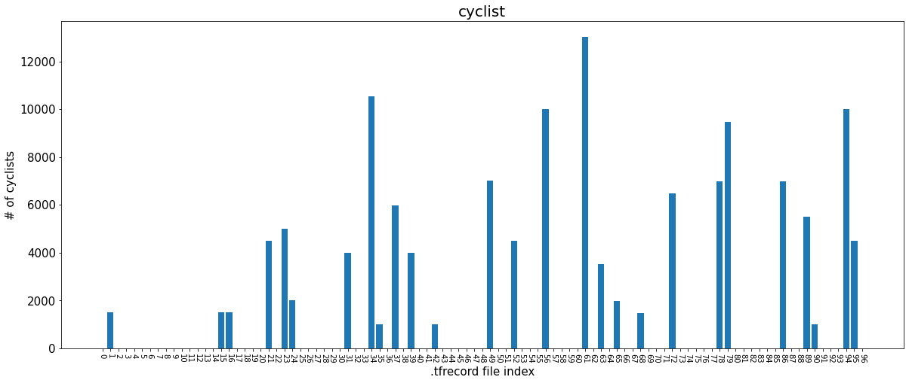

As you can see in the above plots, some of .tfrecord files do not contain pedestrains or cyclists and this could be a problem. For example, if we split .tfrecord files randomly into train and validation data by 8:2 and accidentally validation data do not contain any cyclists, then we cannot validate model's performance of them accurately. So, to prevent this potential problem, we just need to check the number of each class of .tfrecord files and then assign each .tfrecord file to train or validation data in the ratio of 8:2 carefully to contain all classes in train and validation data both.

## Training

### Reference experiment

|       <!-- -->            |                         <!-- -->                    |
|:-----------------:|:-------------------------------------------:|
|       Model       |                 SSD ResNet50                |
| Data Augmentation | Random Horizontal Flip<br>Random Crop Image |
|     Train Step    |                    25,000                   |
|     Optimizer     |                   Momentum                  |
|   Learning Rate   |                     0.04                    |
|      LR Decay     |                 Cosine Decay                |

Loss

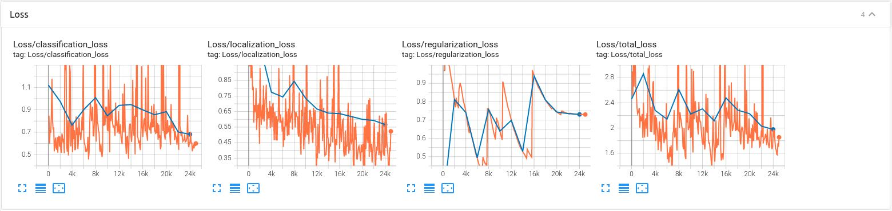
*In loss plot, the orange line indicates training losses and the blue line indicates validation losses.*

mAP

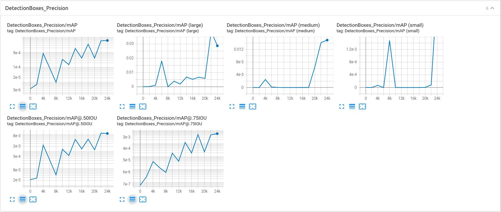

Recall

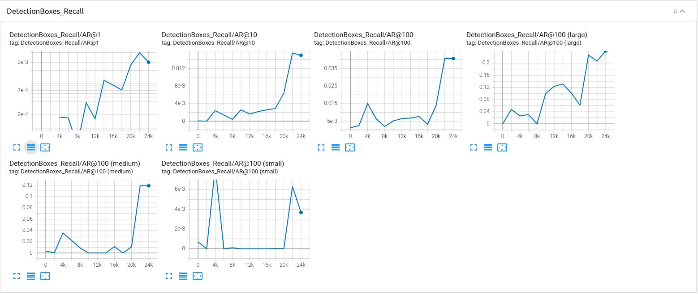

| Metric |  Result  |
|:------:|:--------:|
|   mAP  | 0.006211 |
| Recall | 0.003040 |

As you can see in the loss plot, the total losses of training and validation both decrease, which means training is done without any problem and you can find mAP and recall plot and table of this reference model.

### Improve on the reference

#### 1. Add data augmentation  
Basically, the refence model contains random horizontal flip and random crop image for data augmentation so in addition to them, random adjust brightness and random adjust hue are applied for more augmentation.

|                   |                                                                                             |
|:-----------------:|:-------------------------------------------------------------------------------------------:|
|       Model       |                                         SSD ResNet50                                        |
| Data Augmentation | Random Horizontal Flip<br>Random Crop Image<br>Random Adjust Brightness<br>Random Adjust Hue |
|     Train Step    |                                            25,000                                           |
|     Optimizer     |                                           Momentum                                          |
|   Learning Rate   |                                             0.001                                            |
|      LR Decay     |                                         Cosine Decay                                        |

mAP

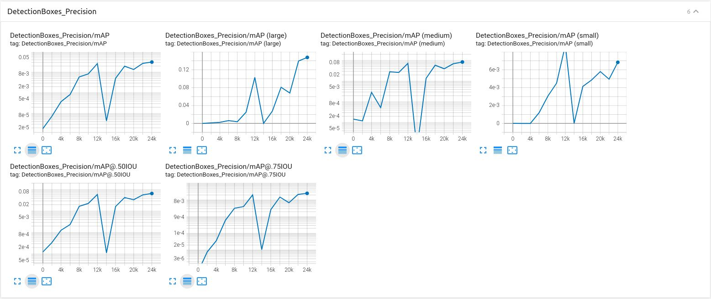

Recall

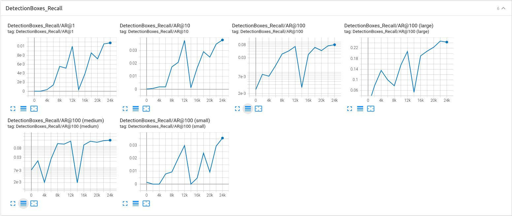

| Metric |  Result  |
|:------:|:--------:|
|   mAP  | 0.03111 |
| Recall | 0.01080 |

By applying additional augmentation, it can be seen that mAP and recall performance both significantly increase compared to the reference model. Accordingly, these data augmentation are used by default in the next experiments.

#### 2. Decrease learning rate and increase epoch
    The starting learning rate of the reference model is 0.04 and it seems to be too large for model to converge well. In this experiment, the learning rate decreases from 0.04 to 0.001 and consquently the train step is also went up because it will converge slower than before with the lower learning rate.

    |                   |                                                                                             |
    |:-----------------:|:-------------------------------------------------------------------------------------------:|
    |       Model       |                                         SSD ResNet50                                        |
    | Data Augmentation | Random Horizontal Flip<br>Random Crop Image<br>Random Adjust Brightness<br>Random Adjust Hue |
    |     Train Step    |                                            50,000                                           |
    |     Optimizer     |                                           Momentum                                          |
    |   Learning Rate   |                                             0.001                                            |
    |      LR Decay     |                                         Cosine Decay                                        |

    mAP

    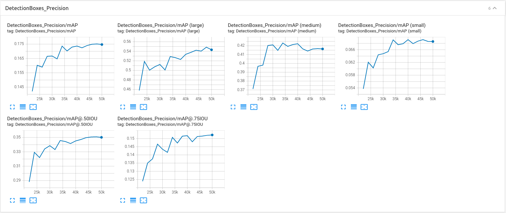

    Recall

    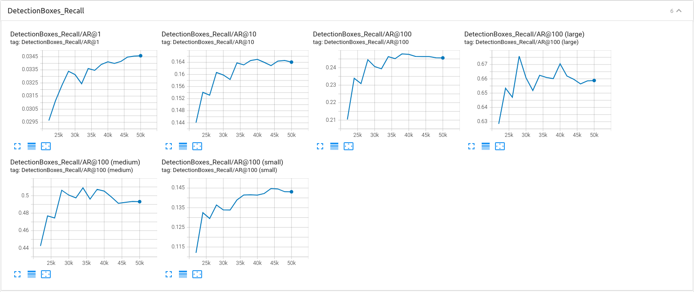

    | Metric |  Result  |
    |:------:|:--------:|
    |   mAP  | 0.1737 |
    | Recall | 0.03458 |

    As a result, with this lower learning rate, the mAP and recall is way better than previous experiments.

3. Change the model (SSD ResNet101)  
    With the same settings, the model is changed from SSD ResNet50 to SSD ResNet101, which is a deeper model than before so better performance is expected.

    |                   |                                                                                             |
    |:-----------------:|:-------------------------------------------------------------------------------------------:|
    |       Model       |                                         SSD ResNet101                                        |
    | Data Augmentation | Random Horizontal Flip<br>Random Crop Image<br>Random Adjust Brightness<br>Random Adjust Hue |
    |     Train Step    |                                            50,000                                           |
    |     Optimizer     |                                           Momentum                                          |
    |   Learning Rate   |                                             0.001                                            |
    |      LR Decay     |                                         Cosine Decay                                        |

    mAP

    

    Recall

    

    | Metric |  Result  |
    |:------:|:--------:|
    |   mAP  |  |
    | Recall |  |

    ...


4. Change the model (SSD ResNet152)  
    SSD ResNet152 is the deepest model amond SSD in tensorflow API and therefore, the best performance is expected.

    |                   |                                                                                             |
    |:-----------------:|:-------------------------------------------------------------------------------------------:|
    |       Model       |                                         SSD ResNet152                                        |
    | Data Augmentation | Random Horizontal Flip<br>Random Crop Image<br>Random Adjust Brightness<br>Random Adjust Hue |
    |     Train Step    |                                            50,000                                           |
    |     Optimizer     |                                           Momentum                                          |
    |   Learning Rate   |                                             0.001                                            |
    |      LR Decay     |                                         Cosine Decay                                        |

    mAP

    

    Recall

    

    | Metric |  Result  |
    |:------:|:--------:|
    |   mAP  |  |
    | Recall |  |

    ...


5. Change the model (EfficientDet)  
    Additionally, another model, EfficientDet, is trained since it shows better performance than SSD in the result of Tensorflow object detection API.

    |                   |                                                                                             |
    |:-----------------:|:-------------------------------------------------------------------------------------------:|
    |       Model       |                                         EfficientDet                                        |
    | Data Augmentation | Random Horizontal Flip<br>Random Crop Image<br>Random Adjust Brightness<br>Random Adjust Hue |
    |     Train Step    |                                            50,000                                           |
    |     Optimizer     |                                           Momentum                                          |
    |   Learning Rate   |                                             0.001                                            |
    |      LR Decay     |                                         Cosine Decay                                        |

    mAP

    

    Recall

    

    | Metric |  Result  |
    |:------:|:--------:|
    |   mAP  |  |
    | Recall |  |

    ...