# Sensor Fusion Mid-term Project
## Step 1 Part 2
This report is for sensor fusion mid-term project and there are two items that needed to be included.
1. Find and display 10 examples of vehicles with varying degrees of visibility in the point-cloud
2. Identify vehicle features that appear as a stable feature on most vehicles (e.g. rear-bumper, tail-lights) and describe them briefly. Also, use the range image viewer from the last example to underpin your findings using the lidar intensity channel.

These tasks will be resolved under below.
1. Find and display 10 examples of vehicles with varying 
degrees of visibility in the point-cloud
2. Identify vehicle features that appear as a stable feature on most vehicles (e.g. rear-bumper, tail-lights) and describe them briefly. Also, use the range image viewer from the last example to underpin your findings using the lidar intensity channel.
    - To do this task, firstly I used open3d visualizer to inpect point clouds in different view point and captured the visualization of them.
    - The images of point cloud in different view point are under below.
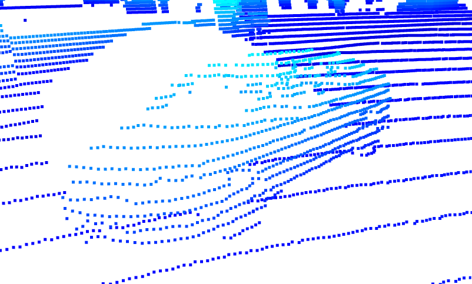
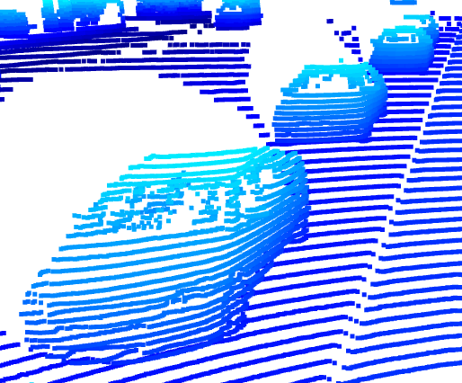
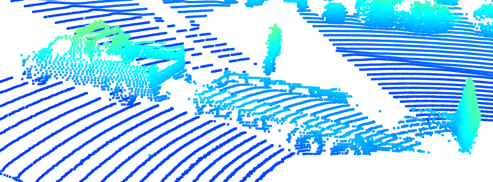
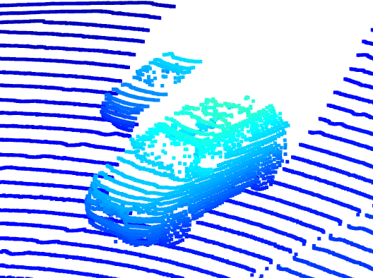
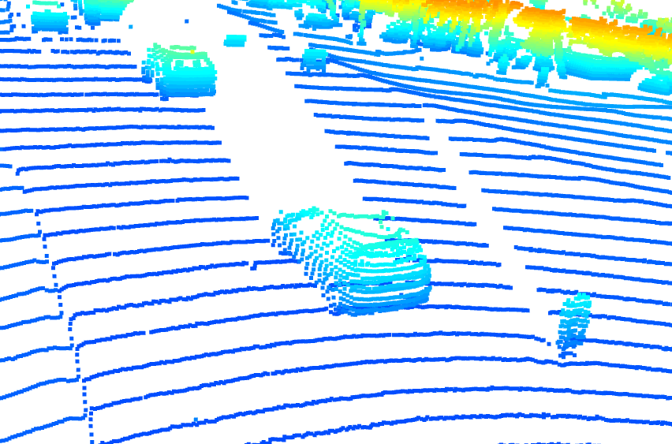
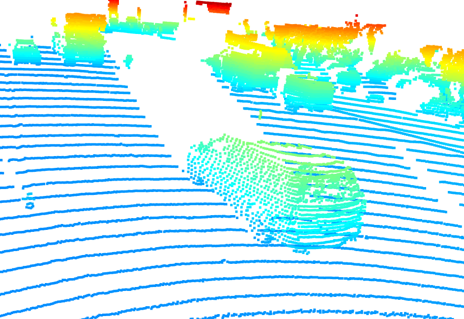
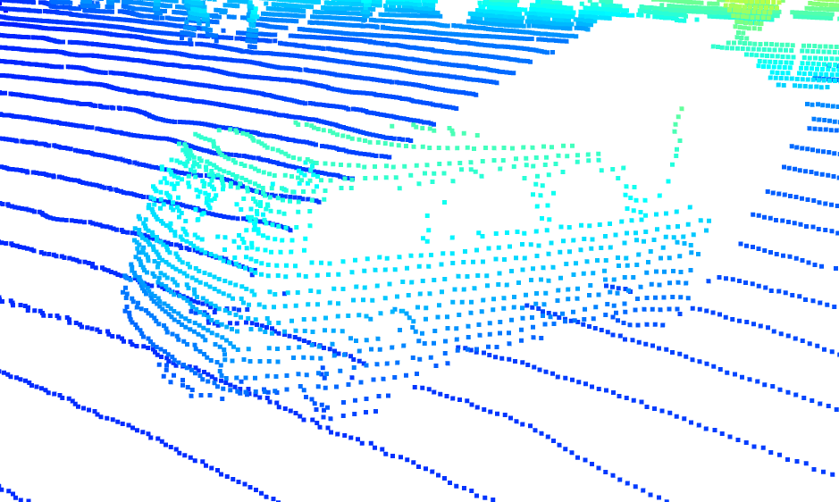
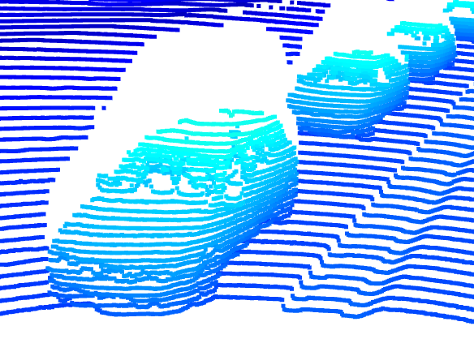
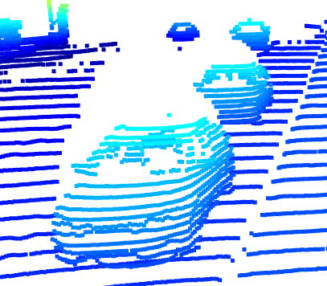
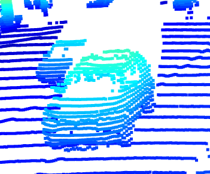
    - In general, at the front side of vehicles, I can see their side mirrors, head lights and front bumpers.
    - Moreover, the interesting thing is that since laser from Lidar can penetrate the windsheid that is usually transparent, there are very few reflected points representing the window so windsheid of vehicles can be easily identified and sometimes I can also recognize headrests or seats of vehicles.
    - Many of the vehicle in point clouds are SUVs or hatchback so I can identify their rear door from point cloud.
    - In the third point cloud, there is a unique vehicle which is a truck with a trailer attached and the trailer looks like empty.
    - Lastly, tires and wheels can be easily identified since their shape is round and are seperate from vehicle bodies.
    - These features that I mentioned above can also be seen in the range image below.
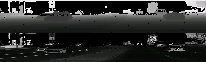
    - If you see the vehicle on the left side of the range image, which is the last example vehicle of the point cloud, clearly the features such as windsheid, head ramp and side mirrors can be identified and even we can see more features like front grill or license plate which are slightly difficult to identify in point cloud.

- Every images are in `examples/`