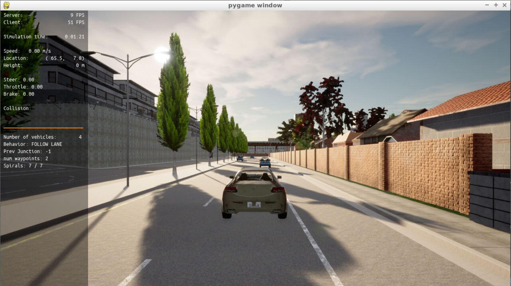

# Control and Trajectory Tracking for Autonomous Vehicle

# Proportional-Integral-Derivative (PID)

In this project, a PID controller is designed in order to perform vehicle trajectory tracking. Given a trajectory as an array of locations, a PID controller controls an ego vehicle and its efficiency is tested on the CARLA simulator used in the industry.

### Installation

Run the following commands to install the starter code in the Udacity Workspace:

Clone the <a href="https://github.com/udacity/nd013-c6-control-starter/tree/master" target="_blank">repository</a>:
``` bash
$ git clone https://github.com/udacity/nd013-c6-control-starter.git
```

## Run Carla Simulator

Open new window

``` bash
* `su - student`
// Will say permission denied, ignore and continue
* `cd ./project`
* `sh run_carla.sh`
```

## Compile and Run the Controller

Open new window
``` bash
$ cd ./project
$ sh base_setting.sh ## This command will execute everything that is needed to be set from "./install-ubuntu.sh" to "cmake ." and "make"
```
## Testing

To test your installation run the following commands.

* `cd ./project`
* `./run_main_pid.sh`
This will silently fail `ctrl + C` to stop
* `./run_main_pid.sh` (again)
Go to desktop mode to see CARLA

If error bind is already in use, or address already being used

* `ps -aux | grep carla`
* `kill id`


## Project Instructions

In the previous project, a path planner for the autonomous vehicle has been built. Now a steer and throttle controller is built so that the car follows the trajectory.

In the directory [./project/pid_controller](https://github.com/udacity/nd013-c6-control-starter/tree/mathilde/project_c6/project/pid_controller)  you will find the files [pid_controller.cpp](https://github.com/udacity/nd013-c6-control-starter/tree/mathilde/project_c6/project/pid_controller/pid.cpp)  and [pid_controller.h](https://github.com/udacity/nd013-c6-control-starter/tree/mathilde/project_c6/project/pid_controller/pid.h). This is where you will code your pid controller.
The function pid is called in [main.cpp](https://github.com/udacity/nd013-c6-control-starter/tree/mathilde/project_c6/project/pid_controller/main.cpp).

### Step 1: Build the PID controller object
The TODOs in the [pid_controller.h](https://github.com/udacity/nd013-c6-control-starter/tree/mathilde/project_c6/project/pid_controller/pid_controller.h) and [pid_controller.cpp](https://github.com/udacity/nd013-c6-control-starter/tree/mathilde/project_c6/project/pid_controller/pid_controller.cpp) are done and the screenshot of the CARLA simulator at this point is added below. As you can see, the ego vehicle are not moving yet.



### Step 2: PID controller for throttle:
1) In [main.cpp](https://github.com/udacity/nd013-c6-control-starter/tree/mathilde/project_c6/project/pid_controller/main.cpp), the throttle error for the throttle PID controller is computed based on the speed difference between the actual speed and the desired speed.
2. The PID parameters($K_p, K_i, K_d$) are tuned to get satisfying results and the results will be explained under below.

### Step 3: PID controller for steer:
1) In [main.cpp](https://github.com/udacity/nd013-c6-control-starter/tree/mathilde/project_c6/project/pid_controller/main.cpp), the steer error for the steer PID controller is computed based on the angle difference between the actual steer and the desired steer to reach the planned position.

2) To get the desired steer angle, the closest point in the desired trajectory from the ego vehicle is found in the code. The angle difference is calculated by `angle_between_points()` function.

3) The PID parameters($K_p, K_i, K_d$) are tuned to get satisfying results and the results will be explained under below.

### Step 4: Evaluate the PID efficiency
The values of the error and the pid command are saved in `thottle_data.txt` and `steer_data.txt`.
Plot the saved values using the command (in `./project`):

```
python3 plot_pid.py
```

## Result video
Here is the result of this project.

https://user-images.githubusercontent.com/73112658/187698074-f7280fbf-9afb-47cc-8c28-0f76a5ee2d7c.mp4

Answer the following questions:
- Add the plots to your report and explain them (describe what you see)
- What is the effect of the PID according to the plots, how each part of the PID affects the control command?
- How would you design a way to automatically tune the PID parameters?
- PID controller is a model free controller, i.e. it does not use a model of the car. Could you explain the pros and cons of this type of controller?
- (Optional) What would you do to improve the PID controller?


### Tips:

- When you wil be testing your c++ code, restart the Carla simulator to remove the former car from the simulation.
- If the simulation freezes on the desktop mode but is still running on the terminal, close the desktop and restart it.
- When you will be tuning the PID parameters, try between those values:

