# Control and Trajectory Tracking for Autonomous Vehicle

# Proportional-Integral-Derivative (PID)

In this project, a PID controller is designed in order to perform vehicle trajectory tracking. Given a trajectory as an array of locations, a PID controller controls an ego vehicle and its efficiency is tested on the CARLA simulator used in the industry.

### Installation

Run the following commands to install the starter code in the Udacity Workspace:

Clone the <a href="https://github.com/udacity/nd013-c6-control-starter/tree/master" target="_blank">repository</a>:
``` bash
$ git clone https://github.com/udacity/nd013-c6-control-starter.git
```

---
## Run Carla Simulator

Open new window

``` bash
* `su - student`
// Will say permission denied, ignore and continue
* `cd ./project`
* `sh run_carla.sh`
```

---
## Compile and Run the Controller

Open new window
``` bash
$ cd ./project
$ sh base_setting.sh ## This command will execute everything that is needed to be set from "./install-ubuntu.sh" to "cmake ." and "make"
```

---
## Testing

To test your installation run the following commands.

* `cd ./project`
* `./run_main_pid.sh`
This will silently fail `ctrl + C` to stop
* `./run_main_pid.sh` (again)
Go to desktop mode to see CARLA

If error bind is already in use, or address already being used

* `ps -aux | grep carla`
* `kill id`

---
## Project Instructions

In the previous project, a path planner for the autonomous vehicle has been built. Now a steer and throttle controller is built so that the car follows the trajectory.

In the directory [./project/pid_controller](https://github.com/udacity/nd013-c6-control-starter/tree/mathilde/project_c6/project/pid_controller)  you will find the files [pid_controller.cpp](https://github.com/udacity/nd013-c6-control-starter/tree/mathilde/project_c6/project/pid_controller/pid.cpp)  and [pid_controller.h](https://github.com/udacity/nd013-c6-control-starter/tree/mathilde/project_c6/project/pid_controller/pid.h). This is where you will code your pid controller.
The function pid is called in [main.cpp](https://github.com/udacity/nd013-c6-control-starter/tree/mathilde/project_c6/project/pid_controller/main.cpp).

### Step 1: Build the PID controller object
The TODOs in the [pid_controller.h](https://github.com/udacity/nd013-c6-control-starter/tree/mathilde/project_c6/project/pid_controller/pid_controller.h) and [pid_controller.cpp](https://github.com/udacity/nd013-c6-control-starter/tree/mathilde/project_c6/project/pid_controller/pid_controller.cpp) are done and the screenshot of the CARLA simulator at this point is added below. As you can see, the ego vehicle are not moving yet.


### Step 2: PID controller for throttle:
1) In [main.cpp](https://github.com/udacity/nd013-c6-control-starter/tree/mathilde/project_c6/project/pid_controller/main.cpp), the throttle error for the throttle PID controller is computed based on the speed difference between the actual speed and the desired speed.
2. The PID parameters($K_p, K_i, K_d$) are tuned to get satisfying results and the results will be explained under below.

### Step 3: PID controller for steer:
1) In [main.cpp](https://github.com/udacity/nd013-c6-control-starter/tree/mathilde/project_c6/project/pid_controller/main.cpp), the steer error for the steer PID controller is computed based on the angle difference between the actual steer and the desired steer to reach the planned position.

2) To get the desired steer angle, the closest point in the desired trajectory from the ego vehicle is found in the code. The angle difference is calculated by `angle_between_points()` function.

3) The PID parameters($K_p, K_i, K_d$) are tuned to get satisfying results and the results will be explained under below.

### Step 4: Evaluate the PID efficiency
The values of the error and the pid command are saved in `thottle_data.txt` and `steer_data.txt`.
Plot the saved values using the command (in `./project`):

```
python3 plot_pid.py
```

---
## Result video
Here is the result of this project.

https://user-images.githubusercontent.com/73112658/187698074-f7280fbf-9afb-47cc-8c28-0f76a5ee2d7c.mp4

---
## Questions
1. Add the plots to your report and explain them (describe what you see)

    Case 1 : It is a reference case so only $K_p$ of both controller are set to 0.1 and when the ego vehicle drives, it hit the third car obstacle in the scenario.


    |Case|Steer|Throttle|
    |:--:|:---:|:------:|
    |1|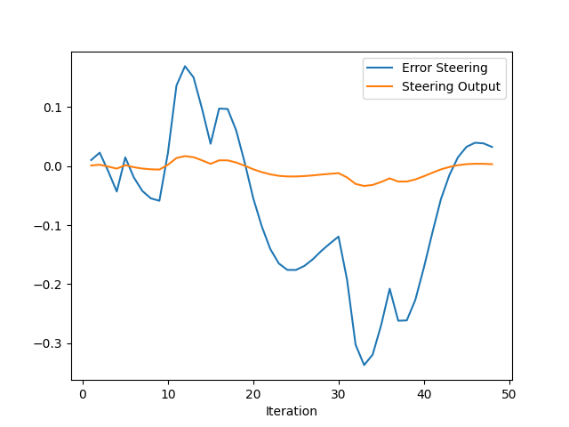 $K_p$ : 0.1, $K_i$ : 0.0, $K_d$ : 0.0|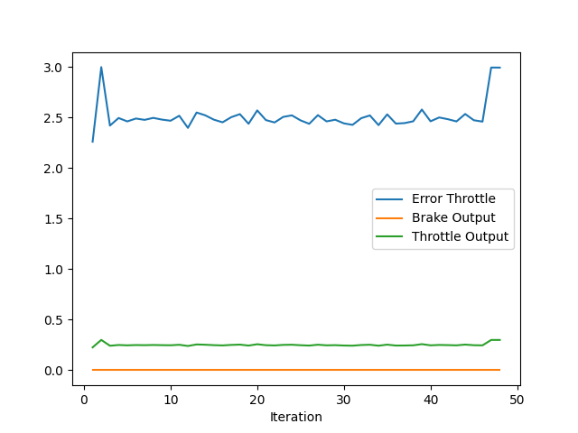 $K_p$ : 0.1, $K_i$ : 0.0, $K_d$ : 0.0|
    
    ---
    Case 2 : $K_p$ of steer controller is increased from 0.1 to 0.3 and it makes the steering output increase propotionally so the amount of steering angle also increase as it can be seen in the plot.
    
    |Case|Steer|Throttle|
    |:--:|:---:|:------:|    
    |2|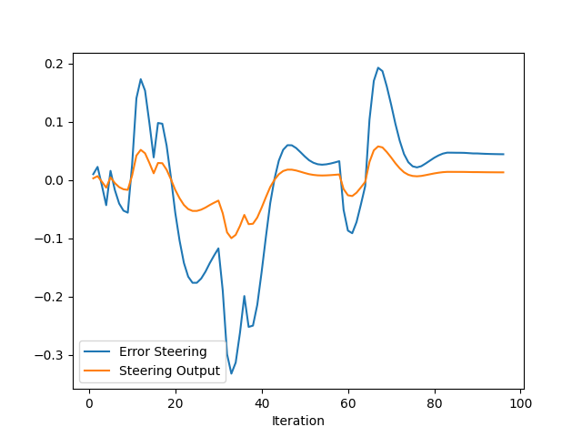 $K_p$ : 0.3, $K_i$ : 0.0, $K_d$ : 0.0|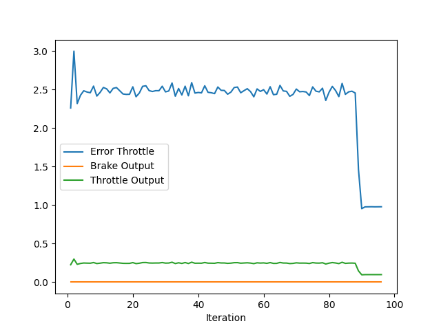 $K_p$ : 0.1, $K_i$ : 0.0, $K_d$ : 0.0|

    ---
    Case 3 : $K_p$ of throttle controller is increased in case 3 from 0.1 to 0.2 and again it propotionally increase the throttle output so that the ego vehicle drives faster than before.
    |Case|Steer|Throttle|
    |:--:|:---:|:------:|  
    |3|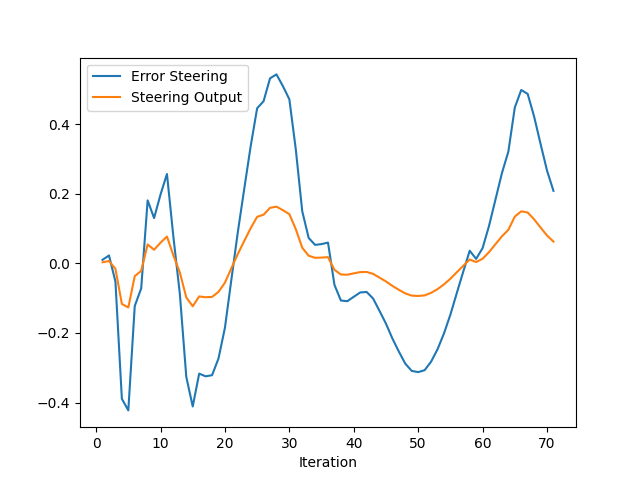 $K_p$ : 0.3, $K_i$ : 0.0, $K_d$ : 0.0|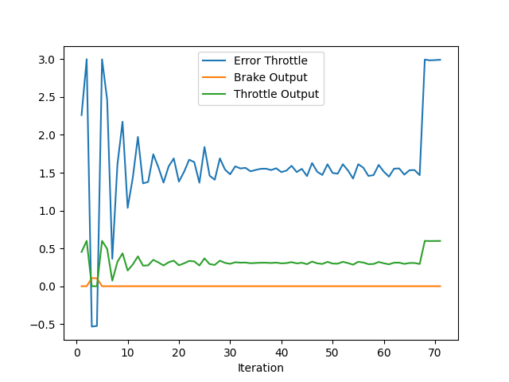 $K_p$ : 0.2, $K_i$ : 0.0, $K_d$ : 0.0|

    ---
    Case 4 : After increasing $K_p$ of both controller, which can directly affect the output, from case 4, $K_i$ and $K_d$ are tuned to decrease the accumulated error and prevent overshoot.
    |Case|Steer|Throttle|
    |:--:|:---:|:------:|  
    |4|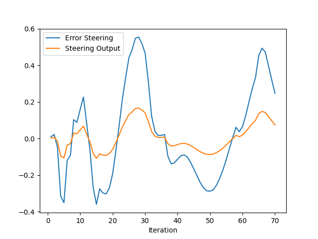 $K_p$ : 0.3, $K_i$ : 0.0005, $K_d$ : 0.0|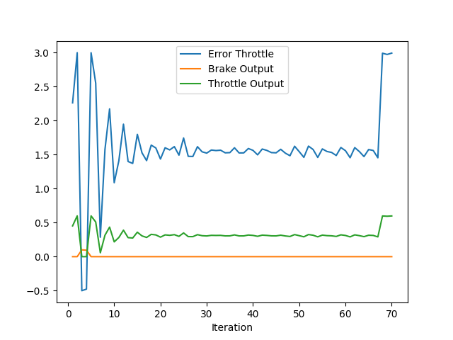 $K_p$ : 0.2, $K_i$ : 0.0, $K_d$ : 0.0|

    ---
    Case 5 : However, even after tuning all parameters of steer controller, the ego vehicle still cannot avoid the third car obstacle.
    |Case|Steer|Throttle|
    |:--:|:---:|:------:|  
    |5|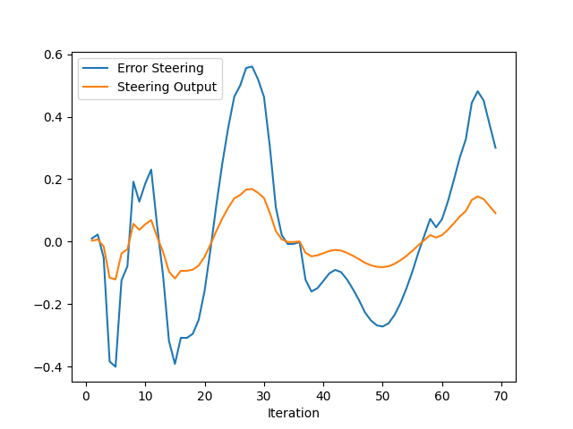 $K_p$ : 0.3, $K_i$ : 0.0005, $K_d$ : 0.0001|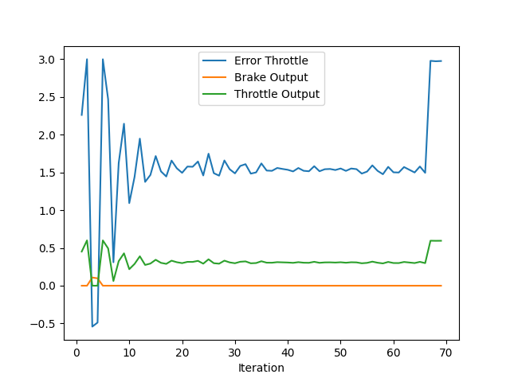 $K_p$ : 0.2, $K_i$ : 0.0, $K_d$ : 0.0|

    ---
    Case 6 : The reason that the ego vehicle crash the obstacle seems like that it does not steer enough to avoid the obstacle so $K_p$ is increased again from 0.3 to 0.5 and finally it starts avoiding every obstacles.
    |Case|Steer|Throttle|
    |:--:|:---:|:------:|  
    |6|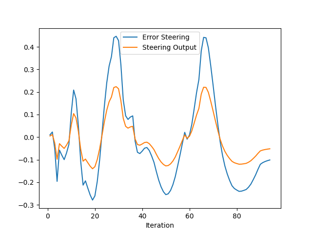 $K_p$ : 0.5, $K_i$ : 0.0005, $K_d$ : 0.0001|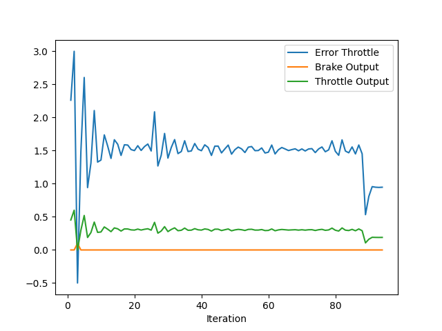 $K_p$ : 0.2, $K_i$ : 0.0, $K_d$ : 0.0|

    ---
    Case 7, 8 : After tuning the parameters of steer controller, from case 7 to case 8, $K_i$ and $K_d$ of throttle controller are tuned.
    |Case|Steer|Throttle|
    |:--:|:---:|:------:|  
    |7|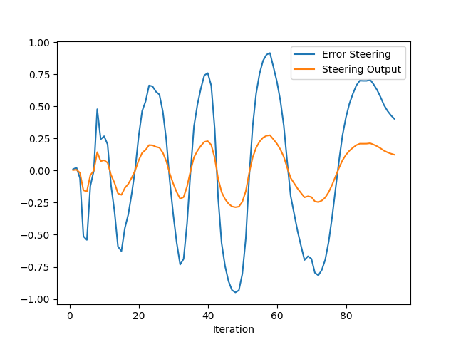 $K_p$ : 0.5, $K_i$ : 0.0005, $K_d$ : 0.0001|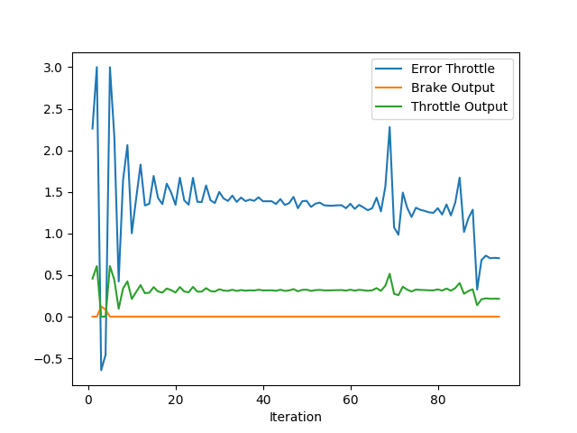 $K_p$ : 0.2, $K_i$ : 0.0005, $K_d$ : 0.0|

    ---
    |Case|Steer|Throttle|
    |:--:|:---:|:------:|  
    |8|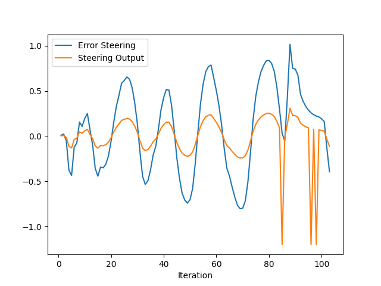 $K_p$ : 0.5, $K_i$ : 0.0005, $K_d$ : 0.0001|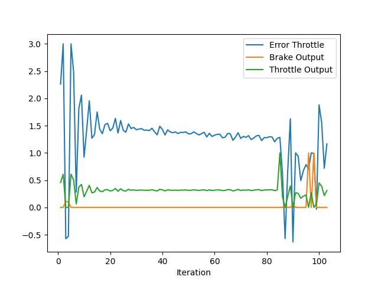 $K_p$ : 0.2, $K_i$ : 0.0005, $K_d$ : 0.0005|

    ---
    Case 9 : However, tuning the parameters of throttle controller cause overshooting of steer controller too much so in order to prevent this, $K_d$ of steer controller is increased and the ego vehicle can drive from starting point to end point without any crash with obstacles.
    |Case|Steer|Throttle|
    |:--:|:---:|:------:|  
    |9|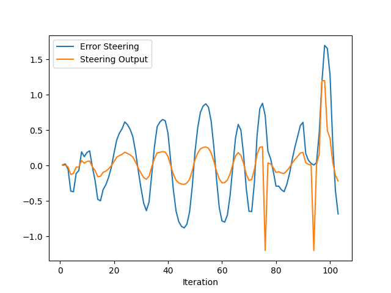 $K_p$ : 0.5, $K_i$ : 0.0005, $K_d$ : 0.05|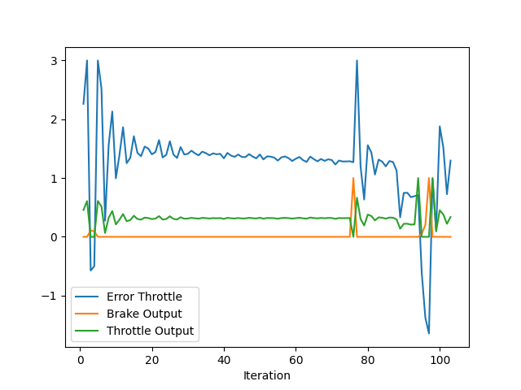 $K_p$ : 0.2, $K_i$ : 0.0005, $K_d$ : 0.0005|
    
    ---
2. What is the effect of the PID according to the plots, how each part of the PID affects the control command?
    - Propotional gain `P` : This gain directly affects the output since it is multiplied with error term so the larger the P gain, the more the output changes similar to the error. 
    - Integral gain `I` : This gain is trying to decrease the accumulated error of the entire driving, which means that this gain has an ability to control the error caused by systematic error.
    - Defferential gain `D` : This gain is applied to the defferential term of error. Accordingly, it can make the actual trajectory of the ego vehicle smoothier and avoid overshooting.


3. How would you design a way to automatically tune the PID parameters?
    - In the lecture, I could learn 'Twiddle', which iteratively repeat the control algorithm to find the best PID parameters that result in the minimum error starting from initial parameters and it can be an option to automatically tune the PID parameters.

4. PID controller is a model free controller, i.e. it does not use a model of the car. Could you explain the pros and cons of this type of controller?
    - Since PID controller is a model free controller, one of the advantages is that it is straightforward to implement and compute the error and the output.
    - However, in reality, the dynamics of vehicle must be considered since sometimes it could be impossible to drive by following the output of controllers.


5. (Optional) What would you do to improve the PID controller?
    - To improve the PID controller, 'Twiddle' can be implemented so that the best parameters is found for driving.